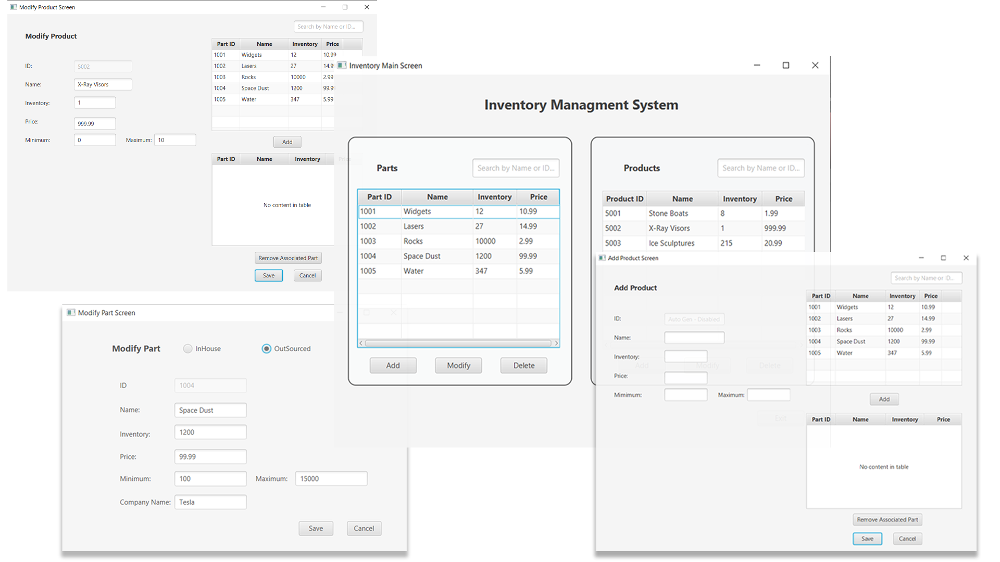

# Inventory Management System (C482)
*A Robust JavaFX Application for Real-Time Inventory Control*

## 📋 Overview
This application provides a streamlined interface for manufacturing firms to manage their parts and products inventory. It features a dual-pane dashboard for simultaneous tracking and multi-level data validation.

**Core Functionality:**
* **Inventory Tracking:** Manage in-house and outsourced parts.
* **Product Association:** Link multiple parts to specific retail products.
* **Validation Engine:** Real-time checking for logical errors (e.g., inventory minimums vs. maximums).
* **Search & Filter:** Instant lookup by ID or Name across all tables.

## 🚀 Getting Started
This project has been modernized to run with **Maven** and **Java 17**.

### Setup Instructions
1. **Clone the Repo:** `git clone https://github.com/hughmorris01/C482_INVENTORY_MANAGEMENT_SYS.git`
2. **Open in IntelliJ:** The IDE will detect the `pom.xml` and download JavaFX automatically.
3. **Run:** Open `src/main/Launcher.java` and click the **Green Play Button**.

## 🛠️ Built With
* **Java 17**
* **JavaFX** (FXML & Controllers)
* **Maven** (Dependency Management)
